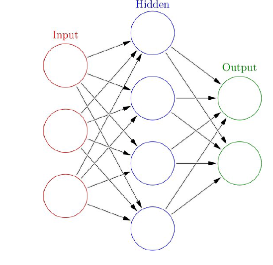
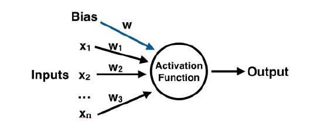
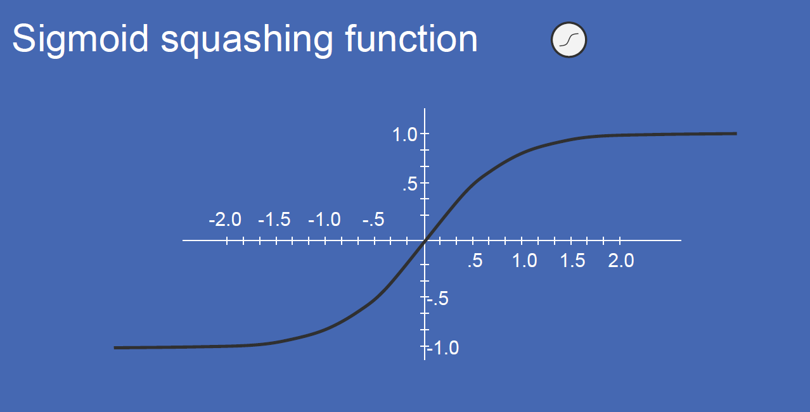
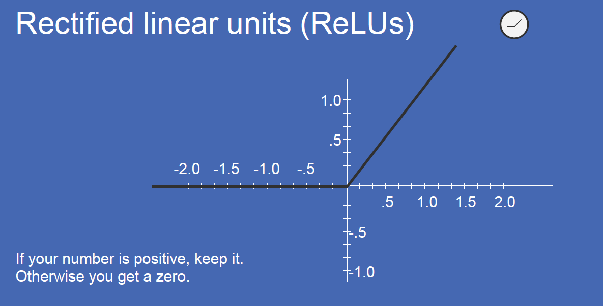

# Overview
In this document we describe with simple example and model how neural networks work, in order to understand the technology that is enabling Artificial Intelligence implementation.

# What we will show
We will build a Neural Network capable of classifying the Iris flower according to the following species:

 


 
As we want to focus on Sinmple Neural Network to keep it easy and understandable, we will base our classification on length and width of Petal and Sepal, according to the Iris Data set. It is in fact known that one can classify the Iris type based on those "features".
In contrast we will not develop an image recognition Convolutional Neural Network as we want to make the Neural Net simple and understandable.

So our input is the Iris Data set summarized here.

```{r}
summary(iris)
```

# Simple Neural Network
A Neural Network consists of neural unit connected among them and connected with the world through input and output. So basically Neural Network has the Input layer, the outpur layer and hidden layers as showed in the following picture, where only one layer is showed:



Note that all neural units are connected to all neural units of the following layer. Such kind of Neural Network is a Feed Forward Neural Network, in contrast to convolutional and recursive Neural Network that have a different architecture. Here we will focus on Feed Forward Neural Network.

Each neural unit receives several numerical input, weight each input and sum the input, before sending to the output the numerical value is processed by a non linear function that is called activation function as showed in the following picture



Note the presence of Bias that is a constant input independent from the actual variable input.

So the Neural Network is basically defined by:

* Number of Neurons in each layer.
* How many hidden layers are present.
* The weigth of each interconnection.
* The activation function at each neuron.
* The bias input to each layer - excluding input layer

Examples of activation function - always non linear as the linearity is embedded in the weights - are 

and 

# Now let's classify the Iris!

As first step we have to create the Neural Network capable of classifing the Iris species. We will be using a standard method based on supervised learning, exactly using 66% of the Iris Data Set above, the 33% Data Set will be use to Validate the Neural Network.

So basicall the Neural Network will learn from examples and than will be evaluated with a classification test.

THe study is based on the R package nnet, that is a simple package that support only one hidden layer but it is powerful enough to train good models and for tutorial reasons.

Let's split the Iris data in trainig set to learn and testing set to test, according to 66% - 33% ratio.

```{r}
set.seed(180)
i <- sample(1:150,100)
iris_train <- iris[i,]
iris_test <- iris[-i,]
summary(iris_train)
```

Now we need 4 neural nodes in input fed by the Sepal and Petal length and width, and 3 neural nodes in output to specify the probability of each species.
Let's consider only one neural node in the hidden layer (only one hidden layer is considered here for simplicity), the activation function we consider is the sigmoid and then the resulting Neural Network looks as follow:

```{r}
library(devtools)
source_url('https://gist.githubusercontent.com/fawda123/7471137/raw/466c1474d0a505ff044412703516c34f1a4684a5/nnet_plot_update.r')
library(nnet)
set.seed(18)
irnn <- nnet(Species ~ ., data = iris_train, size = 1, maxit = 0)
plot.nnet(irnn)

```

So it basically model creation at this point consists of "tuning" the 11 weights and the bias value. This is obatain in an iterative way, starting with random numbers and then changing them with a method called backpropagation in order to minimize the output error, so to minimize the misclassification. The iris_train data is used several time to obtain the convergence.
Let's have a look at how such network works before "learning", so before the weights are tuned. It means basically that we are using random numbers.

```{r}
irpred <- predict(irnn, iris_train, type = "class")
table(iris_train$Species, irpred)
sum(iris_train$Species == irpred) / length(iris_train$Species)

```

Unsurprisingly the accuracy is 36%, that is basically random choice of the Iris type. Now lets apply one cycle learning and see if it improves, so if it learns.

```{r}
library(nnet)
set.seed(18)
irnn <- nnet(Species ~ ., data = iris_train, size = 1, maxit = 1)
irpred <- predict(irnn, iris_train, type = "class")

table(iris_train$Species, irpred)
sum(iris_train$Species == irpred) / length(iris_train$Species)
```

Well it seems that the first learning cycle didn't improve, so let the Neural Network play and play again with the data set as Romans said "Repetita Iuvant": repeating things help! Let's apply the default nnet package 100 repetition.

```{r}
set.seed(18)
irnn <- nnet(Species ~ ., data = iris_train, size = 1)
irpred <- predict(irnn, iris_train, type = "class")


table(iris_train$Species, irpred)
sum(iris_train$Species == irpred) / length(iris_train$Species)

```

Good the Neural Network improved a lot! Now it classifies the Iris species with 73% accuracy! At least in the iris_train. But now let's see if it can understand Species from a new data set, never seen before, not used for traning, the iris_test.

```{r}
irpred <- predict(irnn, iris_test, type = "class")
table(iris_test$Species, irpred)
sum(iris_test$Species == irpred) / length(iris_test$Species)
```

Good! We are 54% with only one neural node. Let's have a look at it, note how the weights changed as you can see with the size of the links between neural nodes.

```{r}
plot.nnet(irnn)
```

Now let's try with a more complex Neural Network, in this case we increase the number of Neural Nodes in the hidden layer to 3

```{r}
set.seed(18)
irnn <- nnet(Species ~ ., data = iris_train, size = 3)
irpred <- predict(irnn, iris_train, type = "class")


table(iris_train$Species, irpred)
sum(iris_train$Species == irpred) / length(iris_train$Species)
```

Very good improvement! We are now at 100% in the training set. This is not surprisingly we imporved, in fact the second models has higher number of neural nodes and connections among them. So basically we evolved the species!
Let's test it against testing set.

```{r}
irpred <- predict(irnn, iris_test, type = "class")
table(iris_test$Species, irpred)
sum(iris_test$Species == irpred) / length(iris_test$Species)

```

Doing very well! 96% Accuracy. Let's have a look at the Neural Net:

```{r}
plot.nnet(irnn)
```


# Conclusion
We have trained a simple Neural Network based on available data that teaches how to classify the Iris species based on sepal-petal length and width. The training consisted of tuning weigths in the Neural Network by going through the trainig set several time. This process is pretty similar to a human learning process, where the man is trained with a controlled environemnt and he can check his results with actual results. 

After the training is completed, meaning that the man is making a limited number of errors, he is ready to face real cases, that is cases where he doesn't know the answer and he has to apply what he learnt.

This is exaclty what we did here with the simple Neural Net exercize. Now the Neural Net can classify Iris. Note also the effect of more neural nodes in the hidden layer that improved the accuracy from 54% to 96%. Note also that an untrained netowork is providing random guess.


