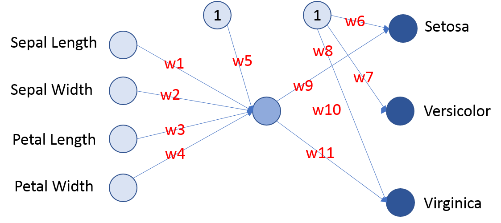

# 1. Overview
In this document we challenge you with the following: **Can you make a classification task better than a simple Neural Network?** While challenging you against Neural Network, you will learn how **Neural Network works** and you will learn a bit more what Artifical Intelligence is, at least in the simplest implementation. In this document when we speak about Neural Network we refer to Artificial Neural Network. 

**In the following you will find**:

* Chapter 2: we will describe the challenge that is classify the Iris Flower species based on key flower characteristics. Even if you don't want to create your model, read this part to understand the Neural Network learning process. 
* Chapter 3: we will explain the Neural Network learning metodology, based on training phase and testing phase.
* Chapter 4: we will briefly explain what a Neural Network is.
* Chapter 5:  we will build two Neural Networks and test how well they can classify the Iris Flower, so you can see if you can do it better than Neural Network or not. For you to know, **the Neural Network here will reach 96% correct answers!** So you have to do better than this! But don't be afraid if you can't, you will understand why at the end.

# 2. The Challenge: Classify Iris Flower
Do you know Iris Flower? The Iris flower species recognition is a typical task to test Algorithms classification, so we will use this test to verify if you can classifiy Iris Flower better than a simple Neural Network.

The Iris flower can be classified according to the three species: Setosa, Versicolor and Virginica. 

As we want to challenge you against a Simple Neural Network to keep it easy and understandable, we will not base our classification on images, but on length and width of Petal and Sepal. As you can see in the following picture, the three types of Iris have different shapes, and it is important to know that they can be classified based on lenght - width of Sepal and Petal, as you can see in the following images:


<p style="text-align:center;"></p>

##### Figure 1 - Iris Flower Species and Attributes to classify them

If you look at the Attribute Information box, you can see Petal and Sepal and few example of training material. Looking at the first row in the Example 5.3,3.7,1.5,0.2,Iris-Setosa, means that one specific flower, one sample, was an Iris Setosa with Sepal Length = 5.3cm, Sepal Width = 3.7cm, Petal Length = 1.5cm and Petal Width = 0.2cm.  

### You try to classify the Iris with this Data!

Now the challenge for you is to try to find "rules" to classify the Iris Flower based on the following 100 Samples. They are basically 100 examples of real Iris flowers, for each Flower you have the Sepal Length, Sepal Width the Petal Length and the Petal Width. 

```{r, echo=FALSE, fig.height= 10}
set.seed(88)
i <- sample(1:150,100)
iris_train <- iris[i,]
iris_test <- iris[-i,]
iris_train
```
##### Table 1 - Data to learn about Iris Species classification

The rules that you can find from the above real data are basically defining what you learnt about the Iris Flower. But to test your rules, in other words to test what you learnt, you are required to Classify the following 50 flowers, but in this case you have to provide the Species, and check them against the correct answer.

So hereafter you can find the list of 50 flowers you have to classify after you learnt about Iris Flower:
```{r, echo = FALSE}
iris_test[,c(1:4)]
```
##### Table 2 - Data to provide your classification answers based on what you learnt

and here you can find the correct answers you must check against your answer. At the end you have for example 30 correct answers out of 50 cases, you have 60% correct answers. Note that they are ordered by Species for your convenience. 


```{r, echo = FALSE}
iris_test[,5]
```
##### Table 3 - Correct Answers to check your results

Before you test your model, if you have created one, remember that a 33% correct values can be obtain with random answers, as there are 3 possible equally distributed Species. So you must do better than 33%.

# 3. Neural Network learns by itself

Now regardless you have created your model or not, you understood the process we proposed to you:

1. **Learn** about Iris Species by looking at 100 cases of iris Flowers
2. **Classify** 50 new flowers based on what you learnt
3. **Test** your correct answers comparing your output with the right answers

This is exactly how we will do with the Neural Network, we will Train Neural Network with 100 flowers, we will ask the trained Neural Network to classify 50 new flowers, we will check answers correcteness.

During the process we will learn how Neural Networks work. NOTE that we, as humans, are not going to teach anything to the Neural Network, in fact we might not be able to classify the Iris, even worse we might not be able to write a software program for this task, while the Neural Network is **LEARNING BY ITSELF**. This is the great difference between programming a Computer and let it learn with Neural Networks. Thanks to Artificial Intelligence, more precisely with Narrow Artificial Intelligence implemented with Neural Networks, the machine can do and understand things without being instructed by humans. This is actually true for other tecniques in Machine Learning, but this topic is out of scope here.

Before proceding with the training and the test, let's see how a Neural Network looks like.


# 4. Some Background: What a Neural Network is
A Neural Network consists of neural units connected among them and connected with the world through input and output. So basically Neural Network has:

* one Input layer
* one outpur layer 
* several hidden layers. 

In the case the connections goes in one direction only from input to output such kind of Neural Network is a **Feed Forward Neural Network**. This is in contrast to convolutional and recursive Neural Network that have a different and more complex architecture. 
Here we will focus on Feed Forward Neural Network. 

Each neural unit receives several numerical input, weights each input and sum the input, before sending to the output the numerical value is processed by a non linear function that is called **Activation Function** as showed in the following picture:


##### Figure 3 - Neural Network Architecture

So the Neural Network is basically defined by:

* Number of Neurons in each layer.
* How many hidden layers are present.
* The weigth of each interconnection.
* The activation function at each neuron.
* The bias input to each layer. input layer has no bias.


# 5. Let's challenge the Neural Network to classify the Iris, can it do better than you?

As first step we have to create the Neural Network capable of classifing the Iris species. We will be using the standard method training plus testing as described in the previous paragraph.

So basicall the Neural Network will learn from examples and than will be evaluated with a classification test.

The study is based on the R package nnet, that is a simple package that support only one hidden layer but it is powerful enough to train good models and for tutorial reasons.

From previous chapters you remember that the input to classify the Iris are:

1. Sepal Length
2. Sepal Width 
3. Petal Length
4. Petal Width

**As we have 4 input, we need 4 neural nodes in input** fed by the Sepal and Petal length and width, and **3 neural nodes in output as we have three possible output**:

1. setosa
2. versicolor
3. virginica. 

For each input flower, the Neural Network provides 3 numbers, one associated to each type of Iris, the greatest value identify the answer of the network. For example if we have as output setosa = 19, versicolor = 34, virginca = 2, it means that the input flower is classified as versicolor as it has the highest value associated.

### Neural Node with one single hidden node

As we said we will investigate Neural Network with only one hidden layer. To start with the simplest possible Neural Network, we will consider only one neural node in the hidden layer. the activation function we consider is the **sigmoid** see Figure 3.

As from the previous chapter, the only thing we have to tune now are the weigths in red as you can see in the following picture.


<p style="text-align:center;"></p>

##### Figure 4 - One Hidden node Neural Network. 11 weights to be tuned.

The tuning of the parameters is actually the learning phase, called also trainig phase. The **training phase** for our simple case consists of the following steps:

1. Initialize the 11 weights with random numbers.
2. Input 100 flowers for training.
3. Compare the output with correct answers and calculate an error.
4. Adjust the weights - called backpropagation method - and go to step 2.

The loop is actually stopped either when the error is satisfactory or when a maximum number of iteration is reached.

Those steps defines how **the Neural Network learns**.

It is important to note that if we stop at step 1, we have a random neural network, that is in other words an untrained network.
Intiutively we can expect that such initial Network, that is not trained, is basically providing random output, with an expected accuracy of 33% in this case as we have three possible output.

#### The Initial untrained Neural Network

The following Neural Network represents the Initial Neural Network, before training. The width of the internodes connections is proportional to the weigth. If we test this untrained network with the testing data, we actually obtain the following table, meaning that the Netowrk output is always setosa, and the accuracy is 28%, that is about 33% as expected.


```{r, echo = FALSE, results = FALSE, comment = FALSE, warning= FALSE}
# library(devtools)
#source_url('https://gist.githubusercontent.com/fawda123/7471137/raw/466c1474d0a505ff044412703516c34f1a4684a5/nne#t_plot_update.r')
#library(nnet)
#set.seed(18)
#irnn <- nnet(Species ~ ., data = iris_train, size = 1, maxit = 0)
# plot.nnet(irnn)

```


##### Figure 5 - The Result of untrained Neural Network are basically as good as random choices


```{r, echo = FALSE}
# irpred <- predict(irnn, iris_test, type = "class")
# table(iris_test$Species, irpred)
# sum(iris_test$Species == irpred) / length(iris_test$Species)


```

This is according to our intution, if you don't know anything about a topic, you are going to provide answers with the same correctness of random answer.

#### The Neural Network after one learning cycle

In order to improve, the Neural Network must be fed with examples, as stated before we must go through the training steps to adjust weights and minimize the errors. Let's see how the Neural Network improves going through one single minimization cycle, that is going through the 100 test flowers only once. 

The resulting Network and results with test data as input is in the following picture.


##### Figure 6 - The Neural Network after one cycle training

```{r, echo = FALSE}
# library(nnet)
# set.seed(18)
# irnn <- nnet(Species ~ ., data = iris_train, size = 1, maxit = 1)
# irpred <- predict(irnn, iris_test, type = "class")

# table(iris_test$Species, irpred)
# sum(iris_test$Species == irpred) / length(iris_test$Species)
```

#### The Neural Network after several learning cycles

As the first learning cycle didn't improve the result, so let the Neural Network play and play again with the data set as Romans said "Repetita Iuvant": repeating things helps! Let's apply the default 100 repetition.
After this training, the parameters tuning led to an improvement. Now the accuracy is 54%. See the following picture.


##### Figure 7 - The Neural Network after many cycle training.


```{r, echo = FALSE}
set.seed(18)
# irnn <- nnet(Species ~ ., data = iris_train, size = 1)
# irpred <- predict(irnn, iris_train, type = "class")


# table(iris_train$Species, irpred)
# sum(iris_train$Species == irpred) / length(iris_train$Species)

```


```{r, echo = FALSE}
# irpred <- predict(irnn, iris_test, type = "class")
# table(iris_test$Species, irpred)
# sum(iris_test$Species == irpred) / length(iris_test$Species)
```


```{r, echo = FALSE}
# plot.nnet(irnn)
```

### The Neural Network with three hidden nodes

As the Accuracy is quite low for the one node hidden network, let's try with a more complex Neural Network, in this case we increase the number of Neural Nodes in the hidden layer to 3 and perform several cycles learning. 

```{r, echo = FALSE}
# set.seed(18)
# irnn <- nnet(Species ~ ., data = iris_train, size = 3)
# irpred <- predict(irnn, iris_train, type = "class")


# table(iris_train$Species, irpred)
#sum(iris_train$Species == irpred) / length(iris_train$Species)
```


```{r, echo = FALSE}
# irpred <- predict(irnn, iris_test, type = "class")
# table(iris_test$Species, irpred)
# sum(iris_test$Species == irpred) / length(iris_test$Species)

```

As you can see in the following picture, the three hidden nodes Neural Network is doing much better than the previous one, reaching an accuracy of 96%.

```{r, echo = FALSE}
# plot.nnet(irnn)
```


##### Figure 8 - The Neural Network with three nodes in the hidden layer

Note that in this case we didn't write the weights in the picture for graphical reasons, however you can recognize the increased number of links, so that the weights to be optimized in this case is equal to 27. The ticker the line in the picture the greater the weight is. 

The increased complexity of the Neural Netowork provides improved result. This is according to our intution and common sense, so one can expect that recognizing an image requires much more complex Neural Network.

# 6. Did the Neural Network do better than you?

it is very likely that the simple one hidden layer three nodes Neural Network did better than you in Iris classification. But how can a 12 nodes - 27 weights Neural Network do better than a Human Brain consisting of about $10^{11}$ Neurons EACH with about $10^{4}$ 
weights?

This is because the classification here is based on measures, that are numbers where computer are much better then us. But numbers are not the "real" world, they are abstractions of it. Human Brain in contrast is excellent to work with the real world, that is on actual flowers images rather than measures of it.


# 7. Conclusions

**What we did**:
we explained the architecture of Neural Network and we have trained two simple Neural Networks based on data about how to classify the Iris species based on sepal-petal length and width. Note that this task is in the area of Narrow Artificial Intellingence, that is about doing specific, very well defined tasks.

**Neural Network learn by itself**:
We have seen that we can train a Neural Network just by "showing" examples, there is no need to actually teach Neural Network how to do things, no need to code complex algorithms in computer program. After the training is done, the Neural Network can face real new cases, and apply to them what it learnt. The Neural Network learns by itself.

**How Neural Network learns**:
We have shown that training a Network means actually optimizing the weights of the connections, once we have selected how many hidden layers, how many nodes per hidden layer we want and the activation function to be used. For the sake of simplicity we didn't cover the algorithms to optimize the weights, called stochastic gradient descent with backpropagation technique.

**More complex Neural Network can do better**:
We showed how more complex Neural Network can do better than simple ones, in our case we moved from 54% accuracy with a one hidden neural node to 96% accuracy with three hidden neural nodes.


